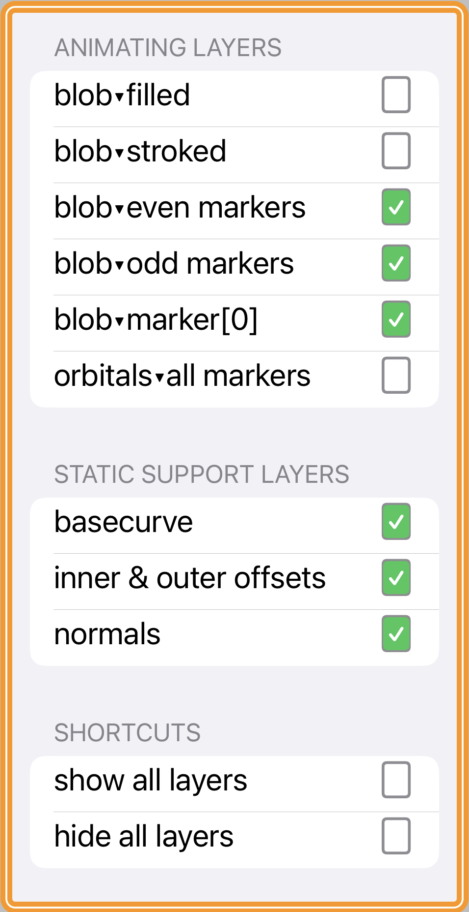

*Everything you always wanted to know about SwiftUI, superellipses, and animations. More generally, how to animate and smooth SwiftUI **`Shape`** objects whose paths consist primarily of computed vertices and the line segments between them.*

This project explores using SwiftUI to create a superellipse-based **`Shape`** object, using a parametric equation to create an array of `(CGPoint, CGVector)` pairs describing the curve. Each `CGPoint` is a vertex on the curve; its corresponding `CGVector` is a unit vector describing the orthogonal, aka normal, at that point. 

`numPoints`, one of the more important arguments to the `SuperEllipse()` initializer, specifies how many vertex/normal pairs to compute. This determines how well or poorly the curve approximates its geometric ideal. Catmull-Rom smoothing during the `SuperEllipse.path()` drawing process goes a long way to making a jagged-looking curve attractive again.

 

**README UNDER CONSTRUCTION**

**WARNING: usage of animated GIFs on this page suck power bigtime. **

 

**0.DeltaWing.GIF**

The above PNG is new.

Here's an extremely simple `SuperEllipse` with 6 vertices. The odd-numbered vertices are shown in red, the even-numbered ones in blue. Just because. The markers for each vertex move in and out along their normals (or orthogonals, if you prefer the fancier term). 

We can select which layers are showing using the **Layers Chooser**, invoked by clicking on the leftmost red LayersChooser icon on the main screen. BezierBlobs uses ZStacks layered to the max. The "markers only" Delta Wing animation above uses 432 stacked `SuperEllipse` Shape layers.

**1.DeltaWing.GIF**

If we don't do any smoothing and constrain the markers' motion along the orthogonals between each normal's endpoints, we see this:

**2.DeltaWing.GIF**

If we use our **Options Chooser** to apply Catmull-Rom smoothing to our main stroking layer, we see this:

**3.DeltaWing.gif**

And if we now let our orthogonal travellers semi-randomly over- or under-shoot the normal's endpoints, we see this:

 

Here's a **`SuperEllipse`** `Shape` object with 6 vertices. The odd-numbered vertices are shown in red, the even-numbered one in blue. Just because.

When we calculate the coordinates of the vertices (a `[CGPoint]` array), we can also calculate the normal vector at each of the vertices.

This project is an exploration of how to animate a family of superellipse-based curves in SwiftUI. Actually it's a bit more general than that: the project shows how to animate between any superellipse-based curve, defined for our purposes as a `[CGPoint, CGVector]` array, where the `CGPoints` are the calculated vertices of the superellipse and the `CGVectors` are their corresponding normals, or orthogonals, and any secondary curve you can derive algorithmically from the first, eg using a simple mapping or transformation. 

`BezierBlobs` runs on both iPhone and the iPad. The user experience at present is better on iPad, due to some unresolved issues that occur when changing orientation between landscape and portrait on the phone. To be fixed (hopefully) ...

Enjoy!
