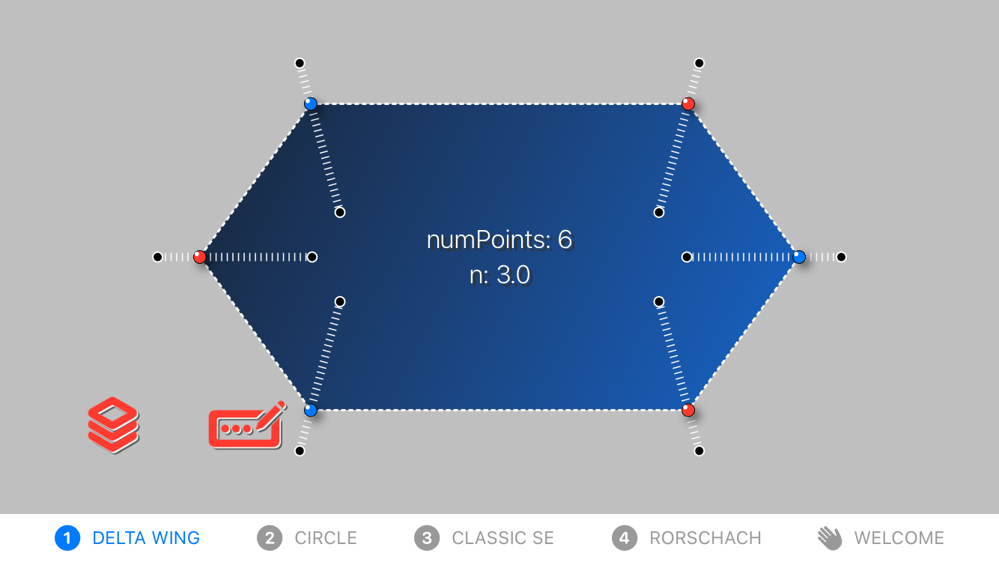
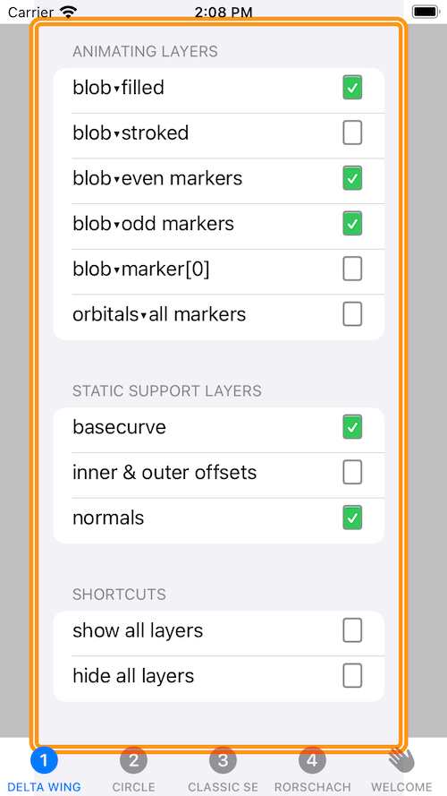

*Everything you always wanted to know about SwiftUI, superellipses, animated blobbie-type things, and the intersection thereof.*

Here's a **`SuperEllipse`** `Shape` object with 6 vertices. The odd-numbered vertices are shown in red, the even-numbered one in blue. Just because.

This project is an exploration of how to animate a family of superellipse-based curves in SwiftUI. Actually it's a bit more general than that: the project shows how to animate between any superellipse-based curve, defined for our purposes as a `[CGPoint, CGVector]` array, where the `CGPoints` are the calculated vertices of the superellipse and the `CGVectors` are their corresponding normals, or orthogonals, and any secondary curve you can derive algorithmically from the first, eg using a simple mapping or transformation. 

`BezierBlobs` runs on both iPhone and the iPad. The user experience at present is better on iPad, due to some unresolved issues that occur when changing orientation between landscape and portrait on the phone. To be fixed (hopefully) ...

Enjoy!
