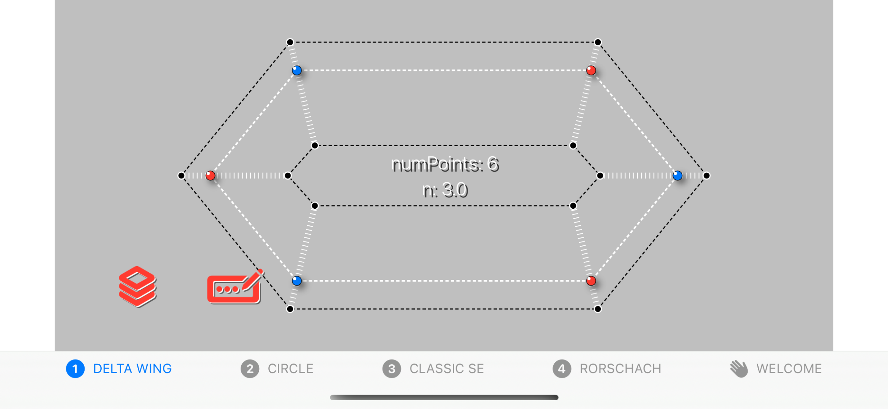

Superellipses are fun for exploring how to do animations in SwiftUI for a number of reasons:

1) They're interesting structures in their own right and can vary hugely and in fascinating ways in appearance, depending on the values of the parameters we pass in to our parametric equation in `model.calculateSuperEllipse()`.

2) One of those parameters, `numPoints`, stipulates the number of vertices to be plotted. This allows us to specifiy as coarse or as fine-grained an approximation of a hypothetically perfect superellipse as we like.

3) In addition to calculating the position of each vertex as a `CGPoint`, our parametric equation also calculates the orthogonal (ie, normal) at each point as a `CGVector`, which is essentially a unit vector if you remember your first year calculus. Our model stores both these values in an array of tuples:

	`baseCurve = [(vertex: CGPoint, normal: CGVector)]`
	
	where `baseCurve` is the "base" superellipse itself. Most of the other curves used in the animation are derived from this one. Some of these will be a part of our animation, the others are so-called "support curves" -- they're used as part of the calculations we do. We can choose to display any or all of these curves using a UI element I call an `SELayersChooser. (Most of the rest of the iOS world would call this a picker; my app, my nomenclature.) See below.
  
Being able to derive the normal at each vertex allows us to slide our vertex markers in and out along them to provide a variety of differing animation outcomes with very little code.  The main blob or paint-splat-like animation in the project uses these normals to readily compute a secondary `offset` curve that shrinks or enlarges our SuperEllipse by any `offset` amount that we like:

`secondaryCurve = baseCurve.map{ $0.newPoint(at: offset: along: $1)}`
	
`newPoint` is an extension on `CGPoint`. A positive offset moves our vertex outward from the base superellipse (thus creating a larger one) and a negative value moves it inward (thus creating a smaller one). The  `along: $1` argument is the `CGVector` normal we stored with its corresponding `CGPoint` vertex in the original baseCurve.

Here's a simple example of what I'm talking about:

The `SuperEllipse` shown here is very coarse at only six vertices. Starting from the origin of the curve, vertex number 0 at the far right of the figure, all the even-numbered vertices are shown in blue and the odd-numbered ones in red, because it makes the algorithm easier to visualize and explain. 

Each marker is moving back and forth from the so-called `innerOffset` curve to the outer one. All the blue, even-numbered markers move either in or out together, and all the red odd-numbered ones correspondingly all move in the opposite direction all together. 

------------------------------------------------------------

*Everything you always wanted to know about SwiftUI, superellipses, and animations. More generally, how to animate and smooth SwiftUI **`Shape`** objects whose paths consist primarily of computed vertices and the line segments between them.*

This project explores using SwiftUI to create a superellipse-based **`Shape`** object, using a parametric equation to create an array of `(CGPoint, CGVector)` pairs describing the curve. Each `CGPoint` is a vertex on the curve; its corresponding `CGVector` is a unit vector describing the orthogonal, aka normal, at that point. 

`numPoints`, one of the more important arguments to the `SuperEllipse()` initializer, specifies how many vertex/normal pairs to compute. This determines how well or poorly the curve approximates its geometric ideal. Catmull-Rom smoothing during the `SuperEllipse.path()` drawing process goes a long way to making a jagged-looking curve attractive again.

 

**README UNDER CONSTRUCTION**

**WARNING: usage of animated GIFs on this page suck power bigtime. **

 

**0.DeltaWing.GIF**

The above PNG is new.

Here's an extremely simple `SuperEllipse` with 6 vertices. The odd-numbered vertices are shown in red, the even-numbered ones in blue. Just because. The markers for each vertex move in and out along their normals (or orthogonals, if you prefer the fancier term). 

We can select which layers are showing using the **Layers Chooser**, invoked by clicking on the leftmost red LayersChooser icon on the main screen. BezierBlobs uses ZStacks layered to the max. The "markers only" Delta Wing animation above uses 432 stacked `SuperEllipse` Shape layers.

**1.DeltaWing.GIF**

If we don't do any smoothing and constrain the markers' motion along the orthogonals between each normal's endpoints, we see this:

**2.DeltaWing.GIF**

If we use our **Options Chooser** to apply Catmull-Rom smoothing to our main stroking layer, we see this:

**3.DeltaWing.gif**

And if we now let our orthogonal travellers semi-randomly over- or under-shoot the normal's endpoints, we see this:

 

Here's a **`SuperEllipse`** `Shape` object with 6 vertices. The odd-numbered vertices are shown in red, the even-numbered one in blue. Just because.

When we calculate the coordinates of the vertices (a `[CGPoint]` array), we can also calculate the normal vector at each of the vertices.

This project is an exploration of how to animate a family of superellipse-based curves in SwiftUI. Actually it's a bit more general than that: the project shows how to animate between any superellipse-based curve, defined for our purposes as a `[CGPoint, CGVector]` array, where the `CGPoints` are the calculated vertices of the superellipse and the `CGVectors` are their corresponding normals, or orthogonals, and any secondary curve you can derive algorithmically from the first, eg using a simple mapping or transformation. 

`BezierBlobs` runs on both iPhone and the iPad. The user experience at present is better on iPad, due to some unresolved issues that occur when changing orientation between landscape and portrait on the phone. To be fixed (hopefully) ...

Enjoy!
